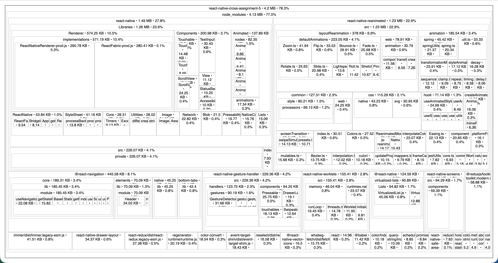
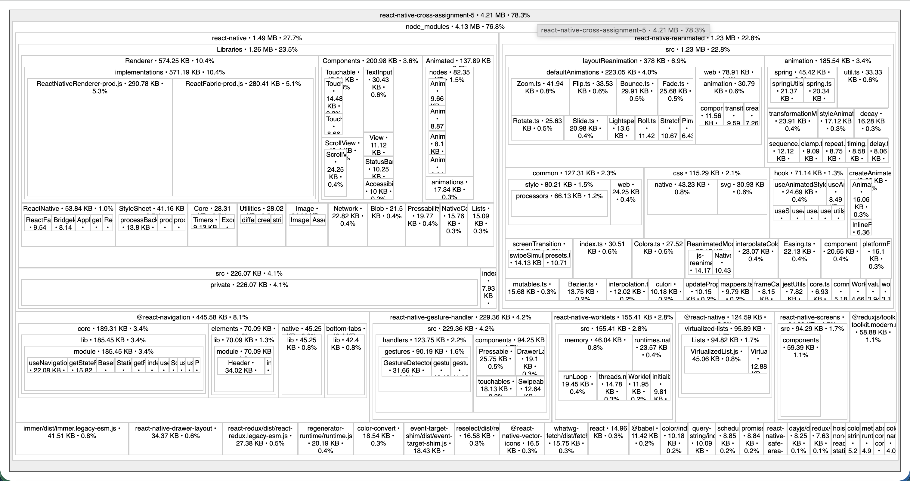

This is a React Native homework project for cross assignment 7 (performance optimisation).

## Assignment 7: Performance Optimisation

### Task 1 — Analysis

| Area          | Component                      | Issue                                                                                                                                                 |
| ------------- | ------------------------------ | ----------------------------------------------------------------------------------------------------------------------------------------------------- |
| Animation     | `ProductCard`                  | No visual feedback on press; `react-native-reanimated` was installed but unused                                                                       |
| Re-renders    | `CartRow` in `CartScreen`      | Every Redux state change (e.g. incrementing one item) re-rendered **all** rows because callbacks were recreated inline and no memoisation was applied |
| Bundle weight | `@react-native/new-app-screen` | 0.85.3 demo package (~60 kB) was listed as a runtime dependency but never imported anywhere in the codebase                                           |

---

### Task 2 — Animation with Reanimated (`ProductCard`)

**File:** `src/components/ProductCard.tsx`

Replaced the plain `TouchableOpacity` wrapper with a spring-scale press animation using `react-native-reanimated` v4 and `react-native-gesture-handler`:

- `useSharedValue(1)` — stores the card's current scale on the UI thread.
- `useAnimatedStyle` — derives the `transform: [{ scale }]` style reactively on the UI thread (no JS bridge round-trip).
- `Gesture.Tap()` with `.onBegin` / `.onFinalize` — squishes the card to `0.93` on press down and springs back to `1.0` on release.
- `withSpring({ damping: 12, stiffness: 200 })` — gives a natural elastic bounce instead of a linear transition.

**Before:** card had only `activeOpacity={0.84}` (a simple opacity dip).  
**After:** card scales down and bounces back with a spring animation visible on every product press.

[Animation demo](screenshots/animation.mov)

---

### Task 3 — Re-render optimisation (`CartScreen` / `CartRow`)

**File:** `src/screens/CartScreen.tsx`

Three optimisation techniques applied:

| Technique     | Applied to                                                                | Effect                                                                                                                       |
| ------------- | ------------------------------------------------------------------------- | ---------------------------------------------------------------------------------------------------------------------------- |
| `React.memo`  | `CartRow` component                                                       | Row skips re-render when its own `item`, `onRemove`, `onDecrement`, `onIncrement` props are reference-equal                  |
| `useCallback` | `handleRemove`, `handleDecrement`, `handleIncrement`                      | Stable function references across renders (only `dispatch` is a dependency, which Redux guarantees is stable)                |
| `useMemo`     | `total` computation in `CartScreen`, `lineTotal` computation in `CartRow` | Price string parsing + multiplication only re-runs when `cart` (or individual `item.price`/`item.quantity`) actually changes |

**Before:** pressing `+` on item A caused every `CartRow` (including items B, C, …) to re-render because the handler functions were re-created on each `CartScreen` render, breaking `memo`'s shallow comparison.  
**After:** only the row whose quantity changed re-renders.

---

### Task 4 — Dependency cleanup / bundle reduction

**Removed:** `@react-native/new-app-screen` (0.85.3)  
This is a boilerplate demo package generated by `react-native init`. It was listed as a runtime dependency but was never imported anywhere in the project, adding dead weight to the bundle.

**Added:** `dayjs` (^1.11.x)  
`dayjs` is a minimal date formatting library (~2 kB gzipped). It was added to replace manual date string handling and to demonstrate a lightweight alternative to heavier date libraries that are common in other projects.

**Used in:** `src/utils/formatDate.ts` → `formatOrderDate(isoDate)` → consumed by `HistoryScreen` to format order timestamps (e.g. `"May 24, 2026 · 14:30"`).

**Bundle analysis command:**

```sh
# react-native-bundle-visualizer handles Metro source maps correctly
npx react-native-bundle-visualizer
```

## 

## 

## Assignment 6: Context API and Redux

Assignment 6 adds global state management on top of the existing navigation and API work from assignment 5.

### Context API — Theme (light / dark)

`ThemeContext` provides a `theme` value (`'light'` | `'dark'`), a full set of
`colors`, and a `toggleTheme` function. `ThemeProvider` wraps the root of the
app so every screen and component reads colours from the context instead of the
static `src/constants/theme.ts` file.

The toggle is exposed as a `Switch` on the **Profile** screen. Switching it
re-renders the whole app in the opposite colour scheme.

Relevant files:

- `src/context/ThemeContext.tsx` — context, provider and `useTheme()` hook
- `src/screens/ProfileScreen.tsx` — Switch to toggle the theme
- Every screen and component uses `useTheme()` for colours

### Redux — Shopping Cart

`cartSlice` manages the cart state with three reducers:

| Action                             | Behaviour                                                                             |
| ---------------------------------- | ------------------------------------------------------------------------------------- |
| `addItem(product)`                 | Adds the product with `quantity: 1`; increments quantity if it is already in the cart |
| `removeItem(id)`                   | Removes the item with the given id                                                    |
| `updateQuantity({ id, quantity })` | Updates item quantity; removes the item if quantity ≤ 0                               |

The Redux `store` is provided at the root via `<Provider>`. Screens access state
with `useSelector` and dispatch actions with `useDispatch`.

Relevant files:

- `src/store/cartSlice.ts` — slice with `addItem`, `removeItem`, `updateQuantity`
- `src/store/store.ts` — `configureStore` with `RootState` and `AppDispatch` types
- `src/screens/CartScreen.tsx` — full cart UI: list, quantity controls, total, empty state
- `src/screens/ProductDetailsScreen.tsx` — "Add to Cart" button dispatches `addItem`
- `src/navigation/TabNavigator.tsx` — cart tab badge shows total item count

---

The app is based on a Figma coffee ordering prototype. Assignment 5 adds
external API data loading on top of the Stack, Tab and Drawer navigation:

- Drawer: coffee menu, help, contacts and log out screens.
- Tabs: menu, cart, order history and profile.
- Stack: menu -> search -> product details -> checkout.
- API: hot coffee menu from `https://api.sampleapis.com/coffee/hot`.

Product cards are loaded with Fetch API, rendered in `FlatList`, and pass
`productId` through `navigation.navigate()`. The product details and checkout
screens read it from `route.params`, load the selected item, and show fallback
states if the id is missing or invalid.

## Implemented UI Components

The app screen is built from reusable React Native components stored in `src/components`:

- `SearchField` - rounded search input from the menu/search screens.
- `ToolbarButton` - Sort and Filter controls with an optional badge.
- `ProductCard` - coffee image, drink name and price.
- `BottomTabBar` - Menu, Favourites, Cart and Profile navigation.
- `RecentSearchList` - recent search item with a remove action.
- `CheckoutHeader` - checkout title bar with back button.
- `PaymentOption` - Apple Pay and Credit card option cards.
- `PayButton` - action button used across the app.
- `ApplePaySheet` - visual mock of the Apple Pay confirmation sheet.
- `SuccessModal` - order confirmation dialog.
- `CoffeeIcon` - wrapper around Lucide vector icons from `@react-native-vector-icons/lucide`.

Shared spacing, radii, typography and platform shadows are stored in `src/constants/theme.ts`.
Theme colours (light and dark) are provided by `src/context/ThemeContext.tsx`.
Demo data is stored in `src/data/products.ts`.
API request logic is stored in `src/api/coffeeApi.ts`.
Navigation constants are stored in `src/constants/screens.ts`, and navigators
are split into `src/navigation/StackNavigator.tsx`,
`src/navigation/TabNavigator.tsx` and `src/navigation/DrawerNavigator.tsx`.

The layout uses `useWindowDimensions` and keeps the prototype responsive for different screen widths and orientations.
Icons use the optional `react-native-vector-icons` family package recommended in the homework tips.

## API and Navigation Demo

[Watch navigation demo](screenshots/navigation-demo.mov)

The demo shows the API coffee list, product details navigation, checkout, tabs
and drawer screens.

# Getting Started

> **Note**: Make sure you have completed the [Set Up Your Environment](https://reactnative.dev/docs/set-up-your-environment) guide before proceeding.

## Step 1: Start Metro

First, you will need to run **Metro**, the JavaScript build tool for React Native.

To start the Metro dev server, run the following command from the root of your React Native project:

```sh
# Using npm
npm start

# OR using Yarn
yarn start
```

## Step 2: Build and run your app

With Metro running, open a new terminal window/pane from the root of your React Native project, and use one of the following commands to build and run your Android or iOS app:

### Android

```sh
# Using npm
npm run android

# OR using Yarn
yarn android
```

### iOS

For iOS, remember to install CocoaPods dependencies (this only needs to be run on first clone or after updating native deps).

The first time you create a new project, run the Ruby bundler to install CocoaPods itself:

```sh
bundle install
```

Then, and every time you update your native dependencies, run:

```sh
bundle exec pod install
```

For more information, please visit [CocoaPods Getting Started guide](https://guides.cocoapods.org/using/getting-started.html).

```sh
# Using npm
npm run ios

# OR using Yarn
yarn ios
```

If everything is set up correctly, you should see your new app running in the Android Emulator, iOS Simulator, or your connected device.

This is one way to run your app — you can also build it directly from Android Studio or Xcode.

## Step 3: Modify your app

Now that you have successfully run the app, let's make changes!

Open `App.tsx` in your text editor of choice and make some changes. When you save, your app will automatically update and reflect these changes — this is powered by [Fast Refresh](https://reactnative.dev/docs/fast-refresh).

When you want to forcefully reload, for example to reset the state of your app, you can perform a full reload:

- **Android**: Press the <kbd>R</kbd> key twice or select **"Reload"** from the **Dev Menu**, accessed via <kbd>Ctrl</kbd> + <kbd>M</kbd> (Windows/Linux) or <kbd>Cmd ⌘</kbd> + <kbd>M</kbd> (macOS).
- **iOS**: Press <kbd>R</kbd> in iOS Simulator.

## Congratulations! :tada:

You've successfully run and modified your React Native App. :partying_face:

### Now what?

- If you want to add this new React Native code to an existing application, check out the [Integration guide](https://reactnative.dev/docs/integration-with-existing-apps).
- If you're curious to learn more about React Native, check out the [docs](https://reactnative.dev/docs/getting-started).

# Troubleshooting

If you're having issues getting the above steps to work, see the [Troubleshooting](https://reactnative.dev/docs/troubleshooting) page.

# Learn More

To learn more about React Native, take a look at the following resources:

- [React Native Website](https://reactnative.dev) - learn more about React Native.
- [Getting Started](https://reactnative.dev/docs/environment-setup) - an **overview** of React Native and how setup your environment.
- [Learn the Basics](https://reactnative.dev/docs/getting-started) - a **guided tour** of the React Native **basics**.
- [Blog](https://reactnative.dev/blog) - read the latest official React Native **Blog** posts.
- [`@facebook/react-native`](https://github.com/facebook/react-native) - the Open Source; GitHub **repository** for React Native.
